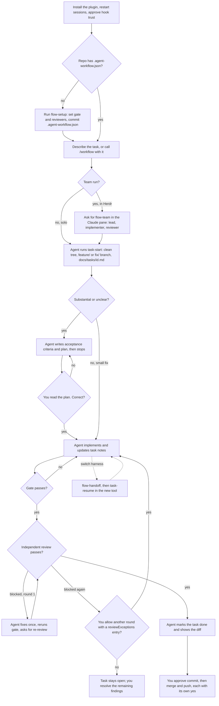

# Flow

How to use the workflow, from install to merge. VS Code draws the diagram in the Markdown preview with the Markdown Preview Mermaid Support extension; GitHub draws it as is.

```mermaid
flowchart TD
    install["Install the plugin, restart sessions, approve hook trust"] --> configured{"Repo has .agent-workflow.json?"}
    configured -- no --> setup["Run flow-setup: set gate and reviewers, commit .agent-workflow.json"]
    setup --> ask
    configured -- yes --> ask["Describe the task, or call /workflow with it"]

    ask --> mode{"Team run?"}
    mode -- "no, solo" --> start["Agent runs task-start: clean tree, feature/ or fix/ branch, docs/tasks/id.md"]
    mode -- "yes, in Herdr" --> team["Ask for flow-team in the Claude pane: lead, implementer, reviewer"]
    team --> start

    start --> size{"Substantial or unclear?"}
    size -- yes --> plan["Agent writes acceptance criteria and plan, then stops"]
    plan --> read{"You read the plan. Correct?"}
    read -- no --> plan
    read -- yes --> build
    size -- "no, small fix" --> build["Agent implements and updates task notes"]

    build --> gate{"Gate passes?"}
    gate -- no --> build
    gate -- yes --> review{"Independent review passes?"}
    review -- "blocked, round 1" --> fix["Agent fixes once, reruns gate, asks for re-review"]
    fix --> review
    review -- "blocked again" --> more{"You allow another round with a reviewExceptions entry?"}
    more -- yes --> build
    more -- no --> open["Task stays open; you resolve the remaining findings"]
    review -- yes --> done["Agent marks the task done and shows the diff"]
    done --> ship["You approve commit, then merge and push, each with its own yes"]

    build -. "switch harness" .-> handoff["flow-handoff, then task-resume in the new tool"]
    handoff -.-> build
```
